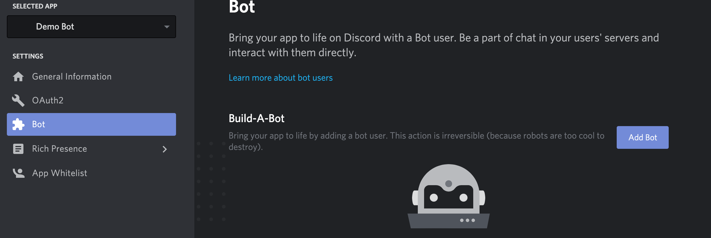

<h1>AMP Strip Bot</h1>

## Table of contents

- [About](#about)
- [Installation and Setup](#installation-and-setup)
- [Acknowledgements](#acknowledgements)

## About

AMP Strip Bot (ASB) is a [Node.js](https://nodejs.org) discord bot that scans user messages for accelerated mobile page (AMP) links, and retrieves the canonical urls.

## Installation and Setup

1. Go to the [discord developer portal](discordapp.com/developers/applications/me), select  *New Application*

    

2. Once application has been created, select *Bot* in the left sidebar. Next, select *Add Bot*.

    

3. Find your *Client ID* and then go to the following URL: https://discordapp.com/oauth2/authorize?&client_id=CLIENT_ID&scope=bot&permissions=8, replacing CLIENT_ID by the Client ID found in the previous step. You should see an option to select the server you want to add your bot to. The channel will say a bot has joined the room, and you’ll see it on the right sidebar under list of online users in the server.

    
    

4. Back in the *Bot* section, under *Token* copy your personal token. **It is very important you do not share this token with anyone - in the case that it is compromised, click regenerate - because it would allow other users to modify and utilize your bot for potential mischief e.g. spamming all the servers your bot has been added to, etc.**

    

5. Finally create a file named *config.json* in the same level as the *index.js* file and add the following content to it, replacing CLIENT_TOKEN with the token you found in the previous step.

```json
{
    "token": "CLIENT_TOKEN"
}
```

**Note: Node.js 12.0.0 or newer is required.**

In order to run the bot, make sure Node.js has been installed, run `npm install` in the project directory. Then run `node index.js` and the bot's status should go from offline to active. To test if the bot is working, send a message with an AMP url in it. Example AMP urls are listed below:

## Acknowledgements

Inspiration for this project was taken from [KilledMufasa's AmputatorBot](https://github.com/KilledMufasa/AmputatorBot) which I stumbled upon while browsing Reddit. I wanted to implement a similar bot to work over discord using node.js and this was the final product.

Additionally, [this](https://www.digitaltrends.com/gaming/how-to-make-a-discord-bot/) wonderful article by Steven Petite and Josh Brown saved me a lot of time in the initial setup.
